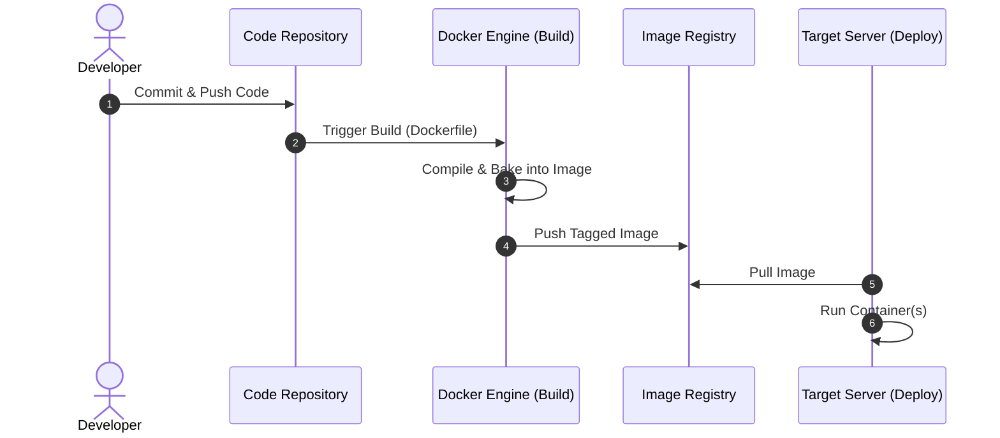

# DEVOPS
DevOps is a software engineering methodology that combines software development (Dev) and IT operations (Ops) to shorten the systems development life cycle and provide continuous delivery with high software quality.

```
Note:
- FDE (Forward Deployed Engineer) - FE + BE + DB + DEVOPS
- FSE (Full Stack Engineer) - FE + BE + DB
```

## Cloud Computing
Cloud computing is the on-demand delivery of computing services—including data storage, servers, databases, networking, and software—over the internet with a pay-as-you-go pricing model.

- IaaS : Hardware (RAM, CPU, Storage, GPU)
    - Inpremises - physical servers
        - maintenance--
        - cost--
        - scalability--
        - geography--
        - fault tolerance--
        - Security++
- PaaS : eg. OS
- SaaS

### Environment:
- PROD
- DEV
- TEST

## Tools for Devops
### DOCKER
***Containerization***


### KUBERNETES
***orchestration***
- scalability
- fault tolerance
- backup/pv
- secret

### JENKINS
***CI/CD***

## Expanded Topics

### DevOps Lifecycle
- **Plan**: requirements, backlog grooming, architecture design.
- **Code**: source control, branching strategies, code reviews.
- **Build**: compile, unit test, static analysis, artifact generation.
- **Test**: integration, performance, security testing, automated test suites.
- **Release**: versioning, artifact promotion, release notes.
- **Deploy**: infrastructure provisioning, blue‑green, canary releases, rollbacks.
- **Operate**: monitoring, logging, alerting, incident response.
- **Monitor**: metrics collection, dashboards, SLO/SLI definition, continuous improvement.

### Cloud Service Models Details
- **IaaS** examples: AWS EC2, Azure VMs, GCP Compute Engine. Provides raw compute, storage, networking; you manage OS, middleware, runtime.
- **PaaS** examples: AWS Elastic Beanstalk, Azure App Service, Google App Engine. Platform abstracts OS and runtime; you focus on application code and configuration.
- **SaaS** examples: Office 365, Salesforce, GitHub. Fully managed applications delivered over the web.

### Environments & Workflows
- **Development** – local machines, feature branches, hot‑reload, mock services.
- **Testing / QA** – isolated test clusters, automated integration tests, contract testing.
- **Staging / Pre‑Prod** – mirror of production for final validation, performance testing.
- **Production** – highly available, auto‑scaling, zero‑downtime deploys, disaster recovery.

### Containerization with Docker
- Dockerfile best practices: use slim base images, pin versions, multi‑stage builds, .dockerignore.
- Image tagging strategy: `repo/app:gitSHA`, `repo/app:latest`, `repo/app:release-<semver>`.
- Registries: Docker Hub, AWS ECR, Azure Container Registry, GitHub Packages.
- Compose for local multi‑service development; use `docker compose up --build`.

### Orchestration with Kubernetes
- Core objects: Pods, Deployments, Services, ConfigMaps, Secrets, PersistentVolumes.
- Service types: ClusterIP, NodePort, LoadBalancer, Ingress.
- Helm charts for packaging; Kustomize for overlays.
- GitOps workflow: store manifests in Git, reconcile with Argo CD or Flux.

### CI/CD Tools Landscape
- Jenkins (pipeline DSL, plugins, agents).
- GitHub Actions (YAML workflows, matrix builds).
- GitLab CI (built‑in runners, environments).
- Azure Pipelines, CircleCI, Travis CI, Bitbucket Pipelines.
- Common stages: `checkout`, `build`, `test`, `publish`, `deploy`.

### Infrastructure as Code (IaC)
- Terraform: declarative, state management, provider ecosystem.
- CloudFormation / Azure ARM / Google Deployment Manager.
- Pulumi (code‑first IaC using general‑purpose languages).

### Monitoring, Logging, Observability
- Metrics: Prometheus + Grafana, CloudWatch, Azure Monitor.
- Logs: ELK stack, Loki, Fluentd, Cloud Logging services.
- Tracing: Jaeger, Zipkin, OpenTelemetry.
- Alerting: Alertmanager, PagerDuty, Opsgenie.

### Security & Compliance (DevSecOps)
- Scan images with Trivy, Clair, or Docker Scout.
- Static code analysis: SonarQube, Dependabot, Snyk.
- Secrets management: HashiCorp Vault, AWS Secrets Manager, Azure Key Vault.
- Policy as code: OPA, Conftest.

### Best Practices
- Keep pipelines immutable and versioned.
- Use declarative configs, avoid mutable state in CI.
- Implement canary or blue‑green deployments for low‑risk releases.
- Automate rollbacks and disaster recovery drills.
- Collect end‑to‑end metrics and feedback loops for continuous improvement.


Images -> Dockerfile
container -> {
    image,
    network,
    env,
    volume
}
postforwarding -> expose